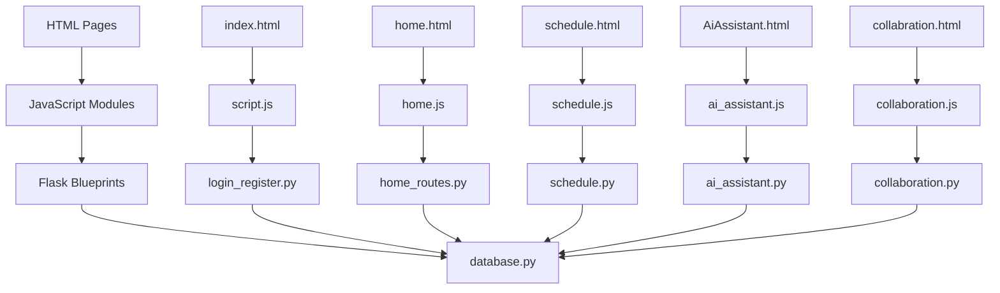

# File Structure & Flow

## 📁 Complete File Structure

```
event-main/
├── 📄 Frontend Files (Root Level)
│   ├── index.html              # Login/Landing page
│   ├── home.html               # Dashboard/Home page
│   ├── profile.html            # User profile management
│   ├── schedule.html           # Schedule/Calendar view
│   ├── AiAssistant.html        # AI Chat interface
│   ├── collabration.html       # Team collaboration
│   ├── AI.html                 # AI features page
│   ├── chtbot.html             # Chatbot interface
│   ├── add-new-task.html       # Task creation form
│   ├── style.css               # Main stylesheet
│   ├── Sstyle.css              # Schedule styles
│   ├── ai.css                  # AI interface styles
│   ├── script.js               # Main JavaScript
│   ├── message.txt             # System messages
│   └── README.md               # Project documentation
│
├── 🐍 Backend/                 # Python Flask Backend
│   ├── app.py                  # Main Flask application
│   ├── config.py               # Configuration settings
│   ├── database.py             # Database connection & setup
│   │
│   ├── 🔐 Authentication & User Management
│   ├── login_register.py       # User auth endpoints
│   ├── user_profile.py         # Profile management
│   │
│   ├── 📅 Core Features
│   ├── home_routes.py          # Home page endpoints
│   ├── schedule.py             # Calendar/schedule APIs
│   ├── tasks.py                # Task management
│   │
│   ├── 🤝 Collaboration
│   ├── collaboration.py        # Team collaboration APIs
│   │
│   ├── 🤖 AI Integration
│   ├── ai_assistant.py         # AI chat functionality
│   ├── ai_scheduler.py         # AI scheduling logic
│   ├── ai.py                   # AI core functions
│   │
│   ├── 📁 config/
│   │   └── settings/
│   │       └── __init__.py     # Config initialization
│   │
│   ├── 📁 static/              # Static assets served by Flask
│   │   ├── style.css           # Main styles
│   │   ├── sstyle.css          # Schedule styles
│   │   ├── cstyle.css          # Collaboration styles
│   │   ├── home.js             # Home page scripts
│   │   ├── schedule.js         # Calendar functionality
│   │   ├── ai_assistant.js     # AI chat scripts
│   │   ├── collaboration.js    # Team features
│   │   └── add_task.js         # Task creation
│   │
│   └── 📁 __pycache__/         # Python bytecode cache
│       └── *.pyc files
│
├── 📁 JS/                      # Additional JavaScript
│   └── ai.js                   # AI-specific scripts
│
└── 📁 Documentation/           # Project documentation
    ├── README.md               # Documentation index
    ├── 01-System-Architecture.md
    ├── 02-File-Structure-Flow.md (this file)
    └── ... (other docs)
```

## 🔄 Data Flow Patterns

### 1. **User Authentication Flow**
```
index.html → script.js → POST /login → login_register.py → database.py → MySQL
    ↓
Session Created → Redirect to home.html
```

### 2. **Home Dashboard Flow**
```
home.html → home.js → GET /api/tasks/today → home_routes.py → database.py
    ↓
Tasks Retrieved → Calendar API → Events Display
```

### 3. **Schedule Management Flow**
```
schedule.html → schedule.js → GET /api/tasks/all → schedule.py → database.py
    ↓
Task CRUD Operations → PUT/POST/DELETE → Database Updates
```

### 4. **AI Assistant Flow**
```
AiAssistant.html → ai_assistant.js → POST /api/ai/chat → ai_assistant.py
    ↓
AI Processing → Gemini/Cohere/Groq APIs → Response → Task Creation
```

### 5. **Collaboration Flow**
```
collabration.html → collaboration.js → POST /api/collaboration/invite
    ↓
collaboration.py → Database → Email Notifications → Task Assignment
```

## 📊 File Relationships

### **HTML → JavaScript → Python → Database**



## 🎨 CSS Architecture

### **Style Organization**
```
style.css          # Global styles, layout, variables
├── Sstyle.css     # Schedule-specific styles
├── ai.css         # AI interface styles
└── cstyle.css     # Collaboration styles

Static Folder:
├── style.css      # Duplicate for Flask serving
├── sstyle.css     # Duplicate for Flask serving
└── cstyle.css     # Duplicate for Flask serving
```

## 🔌 API Endpoint Mapping

### **Frontend → Backend Mapping**
```
Frontend File       JavaScript Module    Backend Module       Database Tables
─────────────────   ─────────────────   ────────────────     ───────────────
index.html         → script.js         → login_register.py  → users
home.html          → home.js           → home_routes.py     → events, users
profile.html       → (inline JS)       → user_profile.py    → users
schedule.html      → schedule.js       → schedule.py        → events
AiAssistant.html   → ai_assistant.js   → ai_assistant.py    → events, users
collabration.html  → collaboration.js  → collaboration.py   → collaborations, assigned_tasks
AI.html            → ai.js             → ai.py              → events
add-new-task.html  → add_task.js       → tasks.py           → events
```

## 📱 Static File Serving

### **Flask Static File Strategy**
```
Route Pattern: /static/<filename>
Flask serves from: Backend/static/
Browser caches: CSS, JS, images
Cache busting: ?v=X.X parameters
```

## 🔄 Session Management Flow

```
User Login → Flask Session Created → Session ID Cookie → Page Access
    ↓
Session Validation on Each Request → Protected Route Access → Response
```

## 🛠️ Development vs Production Files

### **Development Structure**
- Frontend files in root (development convenience)
- Backend serves both static and templates
- Direct file editing and testing

### **Production Considerations**
- Move frontend files to Backend/templates/
- Use proper static file serving (nginx, CDN)
- Minimize and bundle JavaScript/CSS
- Environment-specific configurations

## 📈 Performance Optimization

### **File Loading Strategy**
1. **Critical CSS**: Inline above-the-fold styles
2. **JavaScript**: Async loading for non-critical scripts
3. **Images**: Lazy loading and optimization
4. **Caching**: Browser caching with versioning
5. **Minification**: Production file compression