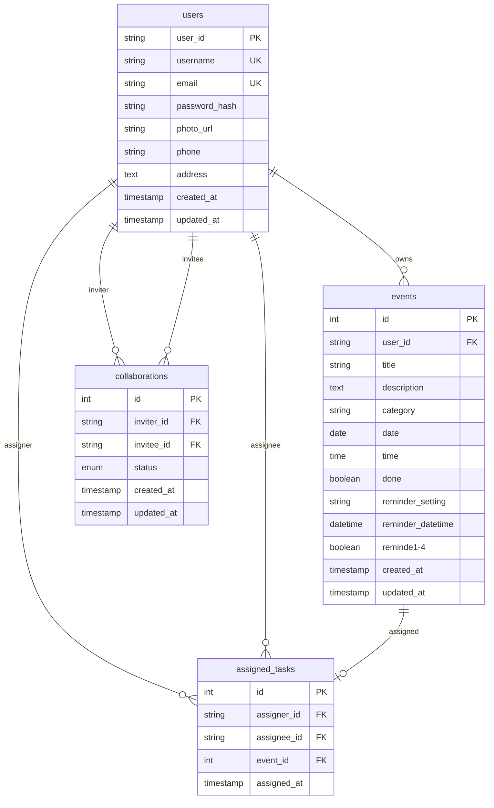

# Database Schema

## 🗄️ MySQL Database Structure

### **Database Name**: `event_management_system`

---

## 📊 Table Schemas

### **1. users** - User Authentication & Profiles
```sql
CREATE TABLE users (
    user_id VARCHAR(36) PRIMARY KEY,           -- UUID for user identification
    username VARCHAR(50) NOT NULL UNIQUE,     -- Unique username
    email VARCHAR(100) NOT NULL UNIQUE,       -- User email (login credential)
    password_hash VARCHAR(255) NOT NULL,      -- Hashed password
    photo_url VARCHAR(255),                   -- Profile photo path
    phone VARCHAR(15),                        -- Phone number
    address TEXT,                             -- User address
    created_at TIMESTAMP DEFAULT CURRENT_TIMESTAMP,
    updated_at TIMESTAMP DEFAULT CURRENT_TIMESTAMP ON UPDATE CURRENT_TIMESTAMP
);
```

### **2. events** - Tasks/Events Storage
```sql
CREATE TABLE events (
    id INT AUTO_INCREMENT PRIMARY KEY,        -- Event/task ID
    user_id VARCHAR(36) NOT NULL,            -- Owner of the event
    title VARCHAR(255) NOT NULL,             -- Event title
    description TEXT,                        -- Event description
    category VARCHAR(50) NOT NULL,           -- Category (work, personal, etc.)
    date DATE NOT NULL,                      -- Event date (YYYY-MM-DD)
    time TIME NOT NULL,                      -- Event time (HH:MM:SS)
    done BOOLEAN DEFAULT FALSE,              -- Completion status
    reminder_setting VARCHAR(20) DEFAULT 'none', -- Reminder preference
    reminder_datetime DATETIME,              -- Calculated reminder time
    reminde1 BOOLEAN DEFAULT FALSE,          -- Reminder flag 1
    reminde2 BOOLEAN DEFAULT FALSE,          -- Reminder flag 2
    reminde3 BOOLEAN DEFAULT FALSE,          -- Reminder flag 3
    reminde4 BOOLEAN DEFAULT FALSE,          -- Reminder flag 4
    created_at TIMESTAMP DEFAULT CURRENT_TIMESTAMP,
    updated_at TIMESTAMP DEFAULT CURRENT_TIMESTAMP ON UPDATE CURRENT_TIMESTAMP,
    
    FOREIGN KEY (user_id) REFERENCES users(user_id) ON DELETE CASCADE,
    INDEX idx_user_date (user_id, date),     -- Optimized for user + date queries
    INDEX idx_date (date),                   -- Optimized for date range queries
    INDEX idx_user_done (user_id, done)      -- Optimized for completion status
);
```

### **3. collaborations** - User Partnerships
```sql
CREATE TABLE collaborations (
    id INT AUTO_INCREMENT PRIMARY KEY,       -- Collaboration ID
    inviter_id VARCHAR(36) NOT NULL,         -- User who sent invitation
    invitee_id VARCHAR(36) NOT NULL,         -- User who received invitation
    status ENUM('pending', 'accepted', 'rejected') DEFAULT 'pending',
    created_at TIMESTAMP DEFAULT CURRENT_TIMESTAMP,
    updated_at TIMESTAMP DEFAULT CURRENT_TIMESTAMP ON UPDATE CURRENT_TIMESTAMP,
    
    FOREIGN KEY (inviter_id) REFERENCES users(user_id) ON DELETE CASCADE,
    FOREIGN KEY (invitee_id) REFERENCES users(user_id) ON DELETE CASCADE,
    UNIQUE KEY unique_collaboration (inviter_id, invitee_id),
    INDEX idx_invitee_status (invitee_id, status)
);
```

### **4. assigned_tasks** - Task Assignments
```sql
CREATE TABLE assigned_tasks (
    id INT AUTO_INCREMENT PRIMARY KEY,       -- Assignment ID
    assigner_id VARCHAR(36) NOT NULL,        -- User who assigned the task
    assignee_id VARCHAR(36) NOT NULL,        -- User who received the task
    event_id INT NOT NULL,                   -- Reference to the task/event
    assigned_at TIMESTAMP DEFAULT CURRENT_TIMESTAMP,
    
    FOREIGN KEY (assigner_id) REFERENCES users(user_id) ON DELETE CASCADE,
    FOREIGN KEY (assignee_id) REFERENCES users(user_id) ON DELETE CASCADE,
    FOREIGN KEY (event_id) REFERENCES events(id) ON DELETE CASCADE,
    UNIQUE KEY unique_assignment (event_id),  -- One assignment per event
    INDEX idx_assignee (assignee_id),
    INDEX idx_assigner (assigner_id)
);
```

---

## 🔗 Entity Relationships



---

## 📈 Data Flow Patterns

### **1. User Registration & Authentication**
```sql
-- Registration
INSERT INTO users (user_id, username, email, password_hash) 
VALUES (UUID(), 'john_doe', 'john@example.com', 'hashed_password');

-- Login Verification
SELECT user_id, username, email FROM users 
WHERE email = 'john@example.com' AND password_hash = 'hashed_password';
```

### **2. Task/Event Operations**
```sql
-- Create Task
INSERT INTO events (user_id, title, description, category, date, time) 
VALUES ('user-uuid', 'Meeting', 'Team standup', 'work', '2025-09-30', '09:00:00');

-- Get User Tasks
SELECT * FROM events 
WHERE user_id = 'user-uuid' 
ORDER BY date, time;

-- Update Task Status
UPDATE events 
SET done = TRUE, updated_at = CURRENT_TIMESTAMP 
WHERE id = 123 AND user_id = 'user-uuid';
```

### **3. Collaboration Operations**
```sql
-- Send Collaboration Invite
INSERT INTO collaborations (inviter_id, invitee_id) 
VALUES ('inviter-uuid', 'invitee-uuid');

-- Accept Collaboration
UPDATE collaborations 
SET status = 'accepted', updated_at = CURRENT_TIMESTAMP 
WHERE id = 1 AND invitee_id = 'invitee-uuid';

-- Get Collaborators
SELECT u.user_id, u.username, u.email 
FROM users u
JOIN collaborations c ON (u.user_id = c.inviter_id OR u.user_id = c.invitee_id)
WHERE (c.inviter_id = 'user-uuid' OR c.invitee_id = 'user-uuid') 
  AND c.status = 'accepted' 
  AND u.user_id != 'user-uuid';
```

### **4. Task Assignment Operations**
```sql
-- Assign Task to Collaborator
-- Step 1: Create the task in events table
INSERT INTO events (user_id, title, description, category, date, time) 
VALUES ('assignee-uuid', 'Assigned Task', 'Description', 'work', '2025-09-30', '10:00:00');

-- Step 2: Create assignment record
INSERT INTO assigned_tasks (assigner_id, assignee_id, event_id) 
VALUES ('assigner-uuid', 'assignee-uuid', LAST_INSERT_ID());

-- Get Tasks Assigned TO User (by others)
SELECT e.*, assigner.email as assigner_email
FROM events e
INNER JOIN assigned_tasks at ON e.id = at.event_id
INNER JOIN users assigner ON at.assigner_id = assigner.user_id
WHERE e.user_id = 'user-uuid' 
  AND at.assignee_id = 'user-uuid' 
  AND at.assigner_id != 'user-uuid'
ORDER BY e.date, e.time;

-- Get Tasks Assigned BY User (to others)
SELECT e.*, u.username as assignee_name
FROM events e
JOIN assigned_tasks at ON e.id = at.event_id
JOIN users u ON at.assignee_id = u.user_id
WHERE at.assigner_id = 'user-uuid'
ORDER BY e.date, e.time;
```

### **5. Calendar View Queries**
```sql
-- Monthly Task Overview
SELECT 
    DAY(date) as day,
    SUM(CASE WHEN done = FALSE THEN 1 ELSE 0 END) > 0 as hasPending,
    SUM(CASE WHEN done = TRUE THEN 1 ELSE 0 END) > 0 as hasCompleted
FROM events 
WHERE user_id = 'user-uuid' 
  AND YEAR(date) = 2025 
  AND MONTH(date) = 9
GROUP BY DAY(date);
```

---

## 🔒 Security Considerations

### **Data Protection**
- **Password Hashing**: Passwords stored as bcrypt hashes
- **UUID Usage**: User IDs are UUIDs, not sequential integers
- **Foreign Key Constraints**: Referential integrity enforced
- **Cascade Deletes**: Related data cleaned up automatically

### **Query Security**
- **Parameterized Queries**: All queries use prepared statements
- **User Isolation**: All queries filter by session user_id
- **Input Validation**: Data validated before database operations
- **SQL Injection Prevention**: No dynamic SQL construction

### **Performance Optimization**
- **Strategic Indexing**: Indexes on frequently queried columns
- **Compound Indexes**: Multi-column indexes for complex queries
- **Query Optimization**: Efficient JOIN operations
- **Connection Pooling**: Database connection reuse

---

## 🕐 Timezone Handling

### **IST (Indian Standard Time) Implementation**
```sql
-- All datetime operations converted to IST (UTC+5:30)
-- Application layer handles timezone conversion
-- Database stores local time values
-- No timezone data stored in database (handled by application)
```

### **Date/Time Storage Pattern**
```sql
-- Events use separate DATE and TIME columns
date: '2025-09-30'        -- YYYY-MM-DD format
time: '14:30:00'          -- HH:MM:SS format

-- Timestamps use TIMESTAMP with automatic updates
created_at: '2025-09-29 14:30:45'
updated_at: '2025-09-29 14:30:45'
```

---

## 📊 Database Maintenance

### **Regular Operations**
```sql
-- Clean up old completed tasks (optional)
DELETE FROM events 
WHERE done = TRUE 
  AND updated_at < DATE_SUB(NOW(), INTERVAL 1 YEAR);

-- Clean up rejected collaborations
DELETE FROM collaborations 
WHERE status = 'rejected' 
  AND updated_at < DATE_SUB(NOW(), INTERVAL 30 DAY);

-- Update statistics
ANALYZE TABLE events, users, collaborations, assigned_tasks;
```