# User Journey Flows

## 🚀 Complete User Experience Flows

---

## 🔐 Authentication Flow

### **New User Registration**
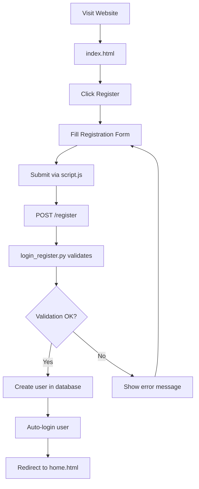

### **Existing User Login**
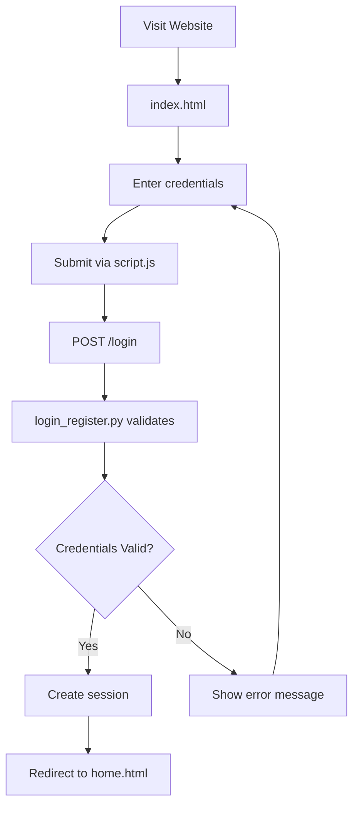

---

## 🏠 Home Dashboard Experience

### **Dashboard Loading Flow**
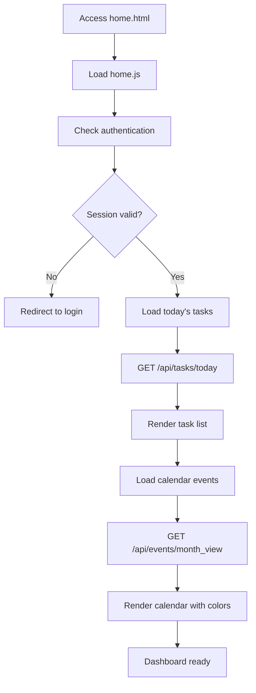

### **Task Creation from Home**
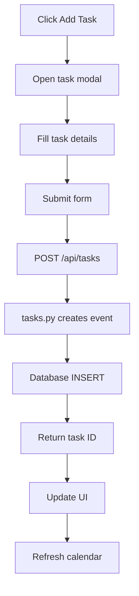

---

## 📅 Schedule Management Flow

### **Schedule Page Navigation**
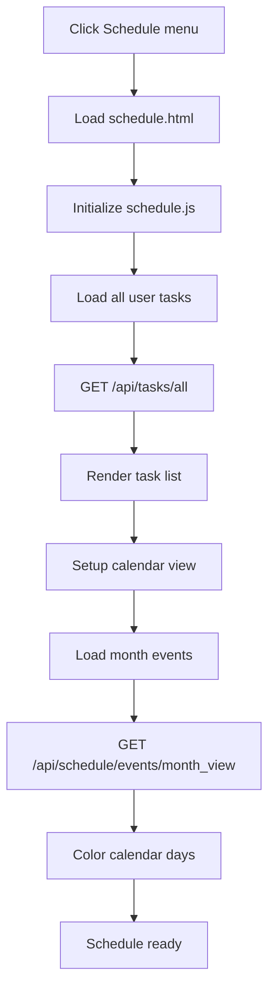

### **Task Management Actions**
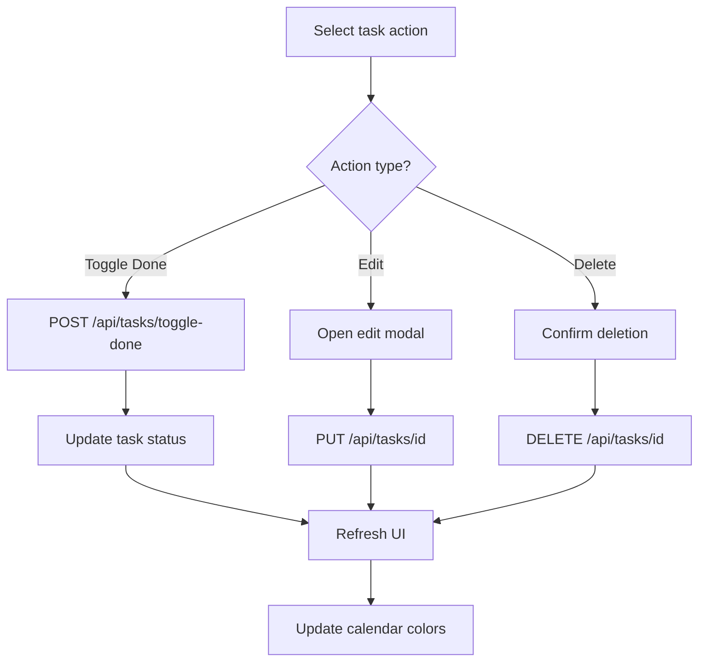

---

## 🤖 AI Assistant Flow

### **AI Chat Interaction**
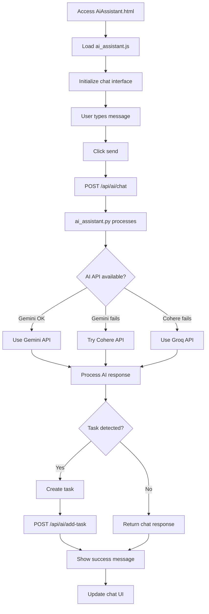

### **AI Schedule Generation**
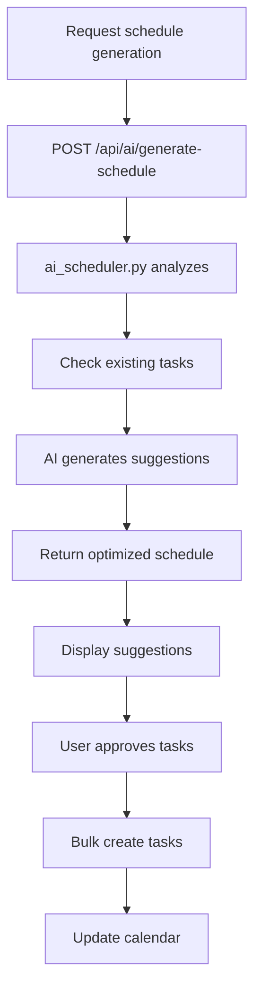

---

## 🤝 Collaboration Flow

### **Inviting Collaborators**
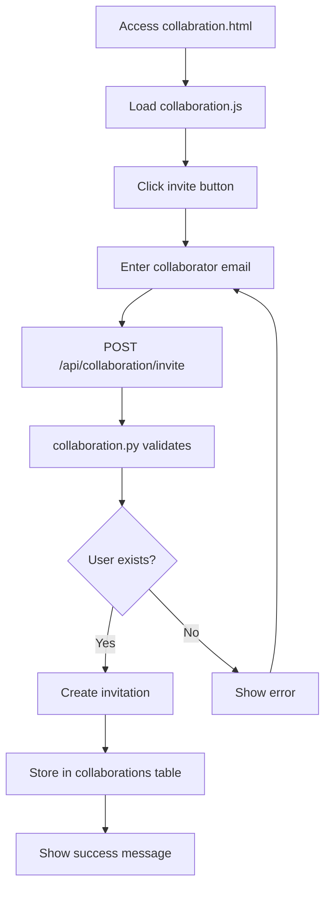

### **Managing Collaboration Requests**
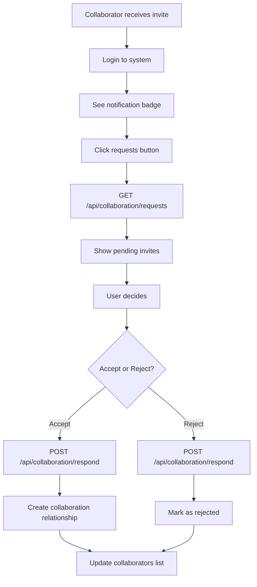

### **Task Assignment Flow**
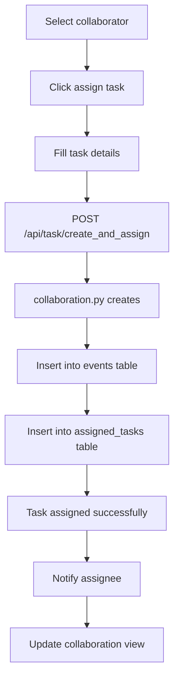

---

## 👤 Profile Management Flow

### **Profile View & Edit**
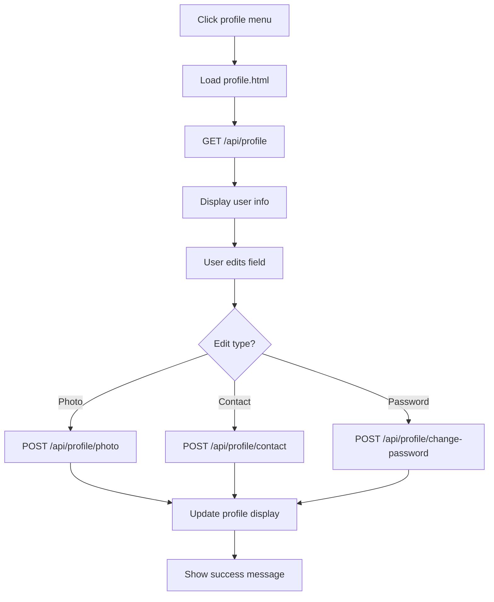

---

## 📱 Calendar Interaction Flow

### **Calendar Navigation**
```mermaid
graph TD
    A[View calendar] --> B[Calendar displays current month]
    B --> C[User navigates]
    C --> D{Navigation action?}
    D -->|Previous month| E[calendarDate.setMonth(-1)]
    D -->|Next month| F[calendarDate.setMonth(+1)]
    D -->|Today button| G[calendarDate = getISTDate()]
    E --> H[Render new calendar]
    F --> H
    G --> H
    H --> I[Fetch month events]
    I --> J[Apply day colors]
    J --> K[Calendar updated]
```

### **Calendar Color Coding**
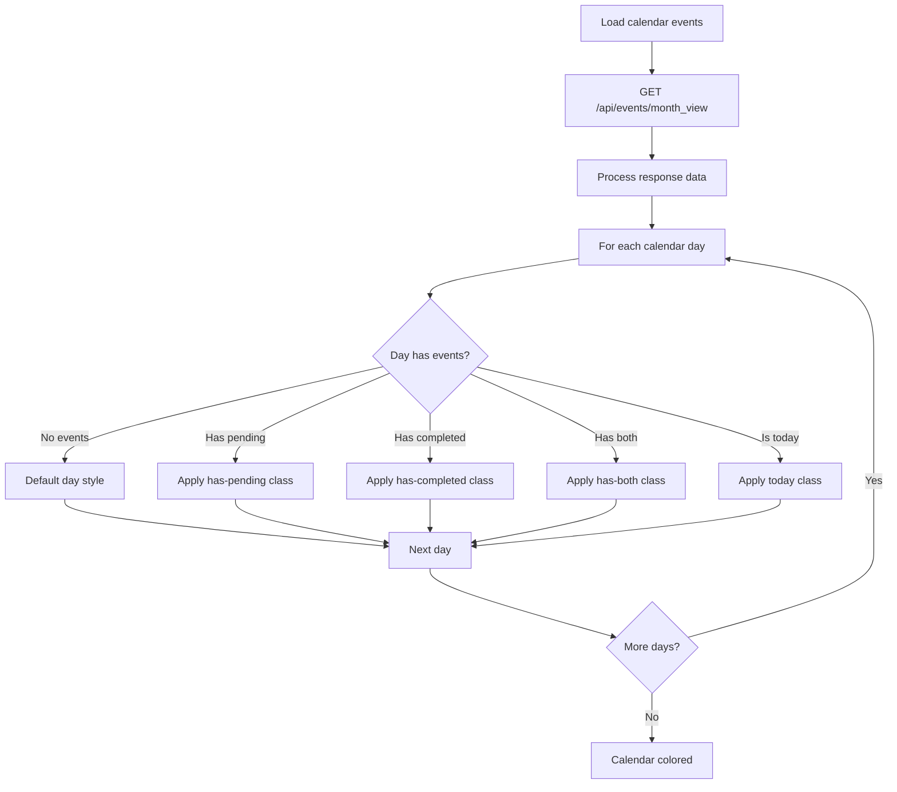

---

## 🔄 Session Management Flow

### **Session Lifecycle**
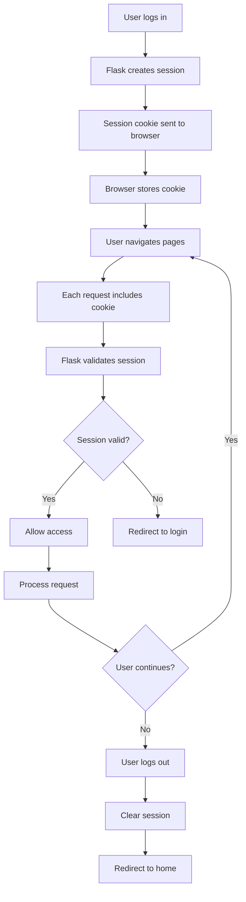

---

## 📊 Error Handling Flow

### **API Error Recovery**
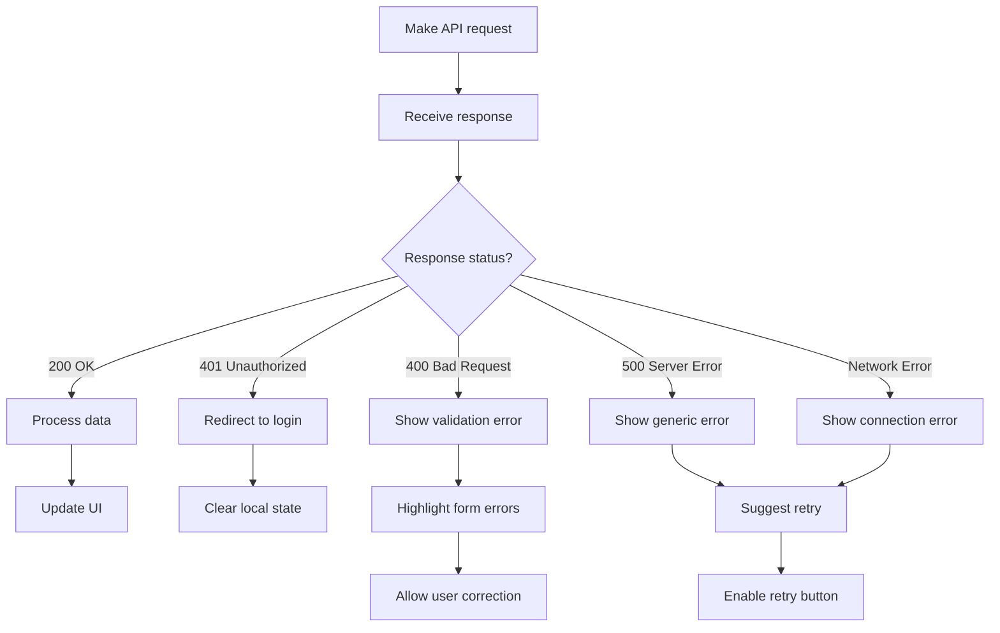

### **AI Fallback Strategy**
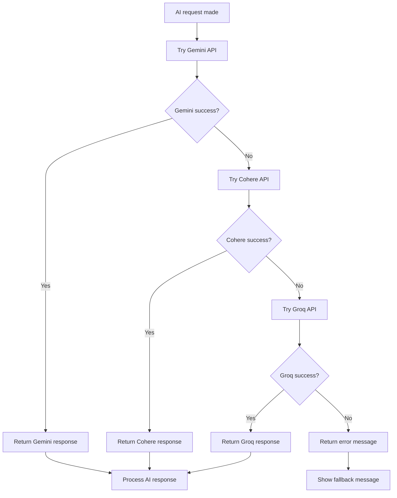

---

## 🎯 Performance Optimization Flow

### **Page Load Optimization**
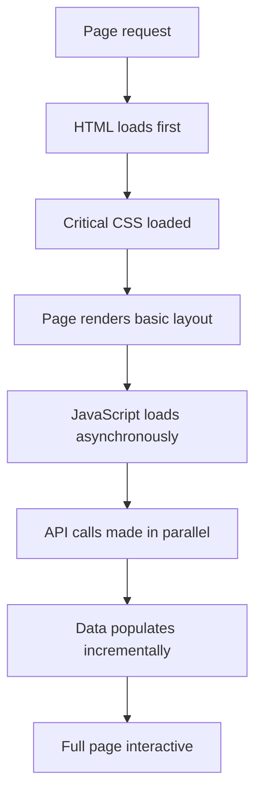