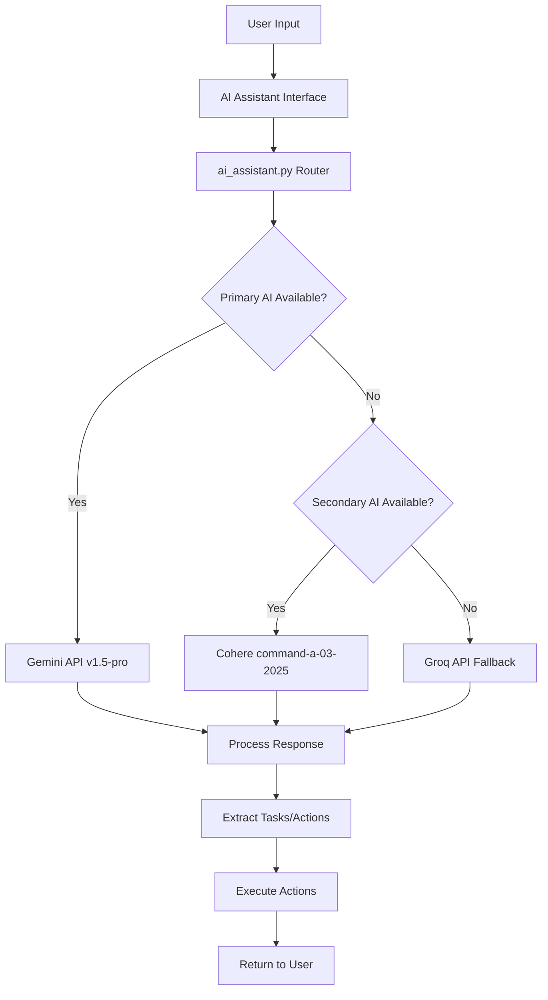

# AI Integration Flow

## 🤖 AI System Architecture

### **Multi-API Strategy Overview**


---

## 🚀 AI Configuration & Setup

### **API Initialization (ai_scheduler.py)**
```python
class AIScheduler:
    def __init__(self):
        # Gemini API (Primary)
        self.gemini_api_key = os.getenv('GEMINI_API_KEY')
        genai.configure(api_key=self.gemini_api_key)
        self.gemini_model = genai.GenerativeModel("gemini-1.5-pro")
        
        # Cohere API (Secondary)  
        self.cohere_api_key = os.getenv('COHERE_API_KEY')
        self.cohere_client = cohere.Client(self.cohere_api_key)
        
        # Groq API (Fallback)
        self.groq_api_key = os.getenv('GROQ_API_KEY')
        self.groq_client = Groq(api_key=self.groq_api_key)
        
        print("AIScheduler initialized - Gemini: ✓, Cohere: ✓, Groq: ✓")
```

### **Environment Configuration**
```bash
# API Keys (stored in environment variables)
GEMINI_API_KEY=your_gemini_api_key
COHERE_API_KEY=your_cohere_api_key  
GROQ_API_KEY=your_groq_api_key
```

---

## 💬 Chat Interface Flow

### **Frontend Chat Component (AiAssistant.html)**
```html
<div class="ai-chat-window" id="ai-chat-window">
    <!-- Initial greeting -->
    <div class="ai-message-bubble incoming">
        Hello! I'm your personal assistant. I can see your schedule. 
        How can I help you plan your tasks today?
    </div>
</div>

<div class="ai-chat-input-bar">
    <textarea id="ai-input-textarea" 
              placeholder="Ask about your schedule..." 
              rows="1"></textarea>
    <button id="ai-send-btn">Send</button>
</div>
```

### **Chat JavaScript Handler (ai_assistant.js)**
```javascript
const sendMessage = async () => {
    const message = inputTextArea.value.trim();
    if (!message) return;
    
    // Disable input during processing
    inputTextArea.disabled = true;
    sendButton.disabled = true;
    
    // Add user message to chat
    appendMessage(message, 'outgoing');
    
    // Show typing indicator
    const typingIndicator = appendMessage('...', 'incoming', true);
    
    try {
        const response = await fetch('/api/ai/chat', {
            method: 'POST',
            headers: { 'Content-Type': 'application/json' },
            body: JSON.stringify({ message: message }),
        });
        
        if (!response.ok) {
            throw new Error('AI service unavailable');
        }
        
        const data = await response.json();
        
        // Remove typing indicator
        typingIndicator.remove();
        
        // Add AI response
        appendMessage(data.reply, 'incoming');
        
    } catch (error) {
        typingIndicator.remove();
        appendMessage(`Error: ${error.message}`, 'incoming', false, true);
    } finally {
        // Re-enable input
        inputTextArea.disabled = false;
        sendButton.disabled = false;
        inputTextArea.focus();
    }
};
```

---

## 🧠 AI Processing Pipeline

### **Chat Processing (ai_assistant.py)**
```python
@ai_bp.route('/api/ai/chat', methods=['POST'])
def ai_chat():
    if 'user_id' not in session:
        return jsonify({"error": "Unauthorized"}), 401
        
    user_id = session['user_id']
    user_message = request.json.get('message', '')
    
    try:
        # Get user's current tasks for context
        user_tasks = get_user_tasks_for_context(user_id)
        
        # Build context-aware prompt
        context_prompt = build_context_prompt(user_message, user_tasks)
        
        # Try AI APIs in order of preference
        ai_response = None
        
        # 1. Try Gemini API (Primary)
        try:
            ai_response = gemini_chat_response(context_prompt)
        except Exception as e:
            print(f"Gemini API failed: {e}")
            
            # 2. Try Cohere API (Secondary)
            try:
                ai_response = cohere_chat_response(context_prompt)
            except Exception as e:
                print(f"Cohere API failed: {e}")
                
                # 3. Try Groq API (Fallback)
                try:
                    ai_response = groq_chat_response(context_prompt)
                    print("Successfully used Groq API as fallback")
                except Exception as e:
                    print(f"All AI APIs failed: {e}")
                    return jsonify({"error": "AI services temporarily unavailable"}), 503
        
        # Process AI response for task extraction
        task_actions = extract_task_actions(ai_response)
        
        # Execute any detected task actions
        if task_actions:
            execute_task_actions(task_actions, user_id)
        
        return jsonify({"reply": ai_response})
        
    except Exception as e:
        return jsonify({"error": str(e)}), 500
```

### **Context Building**
```python
def build_context_prompt(user_message, user_tasks):
    """Build context-aware prompt with user's current tasks"""
    
    # Get current IST time
    ist_now = datetime.now(pytz.timezone('Asia/Kolkata'))
    current_time = ist_now.strftime("%Y-%m-%d %H:%M:%S IST")
    
    # Format existing tasks
    tasks_context = ""
    if user_tasks:
        tasks_context = "Current tasks:\n"
        for task in user_tasks[:10]:  # Limit to recent tasks
            status = "✓ Done" if task['done'] else "⏳ Pending"
            tasks_context += f"- {task['title']} ({task['date']} {task['time']}) - {status}\n"
    
    context_prompt = f"""
You are a helpful personal assistant for task and schedule management.
Current time: {current_time}
User timezone: India Standard Time (IST)

{tasks_context}

User's question: {user_message}

Please provide helpful responses about scheduling, task management, or general assistance.
If the user wants to create, modify, or delete tasks, acknowledge their request and offer to help.
Keep responses conversational and helpful.
"""
    
    return context_prompt
```

---

## 🎯 Task Detection & Extraction

### **Natural Language Task Processing**
```python
def extract_task_actions(ai_response):
    """Extract actionable tasks from AI response"""
    
    task_patterns = [
        r"create.*task.*titled?\s*['\"]([^'\"]+)['\"]",
        r"add.*task.*['\"]([^'\"]+)['\"]",
        r"schedule.*['\"]([^'\"]+)['\"].*(?:on|for)\s*(\d{4}-\d{2}-\d{2})",
        r"reminder.*['\"]([^'\"]+)['\"].*at\s*(\d{1,2}:\d{2})",
    ]
    
    detected_tasks = []
    
    for pattern in task_patterns:
        matches = re.finditer(pattern, ai_response, re.IGNORECASE)
        for match in matches:
            task_data = {
                'title': match.group(1),
                'action': 'create',
                'source': 'ai_detection'
            }
            
            # Extract additional details if available
            if len(match.groups()) > 1:
                task_data['date'] = match.group(2)
                
            detected_tasks.append(task_data)
    
    return detected_tasks
```

### **Task Execution Pipeline**
```python
def execute_task_actions(task_actions, user_id):
    """Execute detected task actions"""
    
    conn = get_db_connection()
    if not conn:
        return False
        
    try:
        cursor = conn.cursor()
        
        for action in task_actions:
            if action['action'] == 'create':
                # Set default values for AI-created tasks
                ist_now = datetime.now(pytz.timezone('Asia/Kolkata'))
                default_date = action.get('date', ist_now.strftime('%Y-%m-%d'))
                default_time = action.get('time', '09:00:00')
                
                # Insert task into database
                cursor.execute("""
                    INSERT INTO events (user_id, title, description, category, date, time, done)
                    VALUES (%s, %s, %s, %s, %s, %s, %s)
                """, (
                    user_id,
                    action['title'],
                    action.get('description', 'Created by AI Assistant'),
                    action.get('category', 'ai-generated'),
                    default_date,
                    default_time,
                    False
                ))
        
        conn.commit()
        return True
        
    except Exception as e:
        print(f"Error executing task actions: {e}")
        conn.rollback()
        return False
    finally:
        if conn and conn.is_connected():
            cursor.close()
            conn.close()
```

---

## 📅 AI Schedule Generation

### **Schedule Generation Endpoint**
```python
@ai_bp.route('/api/ai/generate-schedule', methods=['POST'])
def generate_schedule():
    """Generate optimized schedule suggestions using AI"""
    
    if 'user_id' not in session:
        return jsonify({"error": "Unauthorized"}), 401
    
    user_id = session['user_id']
    preferences = request.json.get('preferences', {})
    
    try:
        # Get user's existing tasks
        existing_tasks = get_user_tasks_for_scheduling(user_id)
        
        # Build schedule generation prompt
        schedule_prompt = build_schedule_prompt(existing_tasks, preferences)
        
        # Generate schedule using AI (with fallback)
        schedule_response = None
        
        try:
            schedule_response = ai_scheduler.generate_schedule_gemini(schedule_prompt)
        except:
            try:
                schedule_response = ai_scheduler.generate_schedule_cohere(schedule_prompt)
            except:
                schedule_response = ai_scheduler.generate_schedule_groq(schedule_prompt)
        
        # Parse and validate suggested schedule
        suggested_tasks = parse_schedule_response(schedule_response)
        
        return jsonify({
            "suggested_schedule": suggested_tasks,
            "message": "Schedule generated successfully"
        })
        
    except Exception as e:
        return jsonify({"error": str(e)}), 500
```

### **Smart Scheduling Logic**
```python
def build_schedule_prompt(existing_tasks, preferences):
    """Build intelligent scheduling prompt"""
    
    ist_now = datetime.now(pytz.timezone('Asia/Kolkata'))
    current_week = ist_now.strftime('%Y-%m-%d')
    
    # Analyze existing task patterns
    task_analysis = analyze_task_patterns(existing_tasks)
    
    prompt = f"""
You are an intelligent scheduling assistant. Generate optimal task suggestions.

Current date: {current_week} (IST)
User's existing task patterns: {task_analysis}
User preferences: {preferences}

Existing tasks:
{format_existing_tasks(existing_tasks)}

Please suggest 5-7 new tasks that would:
1. Fill gaps in the user's schedule
2. Maintain work-life balance
3. Respect user's preferred time slots
4. Include variety (work, personal, health, learning)

Format each suggestion as:
- Title: [Task Name]
- Category: [work/personal/health/learning]
- Suggested Time: [YYYY-MM-DD HH:MM]
- Duration: [estimated minutes]
- Priority: [high/medium/low]
"""
    
    return prompt
```

---

## 🔄 Error Handling & Fallbacks

### **API Fallback Strategy**
```python
class AIAPIManager:
    def __init__(self):
        self.apis = [
            {'name': 'Gemini', 'handler': self.call_gemini, 'priority': 1},
            {'name': 'Cohere', 'handler': self.call_cohere, 'priority': 2}, 
            {'name': 'Groq', 'handler': self.call_groq, 'priority': 3}
        ]
    
    def call_with_fallback(self, prompt, max_retries=3):
        """Call AI APIs with automatic fallback"""
        
        for api in sorted(self.apis, key=lambda x: x['priority']):
            for attempt in range(max_retries):
                try:
                    response = api['handler'](prompt)
                    if response:
                        print(f"Successfully used {api['name']} API")
                        return response
                except Exception as e:
                    print(f"{api['name']} API attempt {attempt + 1} failed: {e}")
                    continue
        
        # All APIs failed
        return "I apologize, but my AI services are temporarily unavailable. Please try again later."
```

### **Graceful Degradation**
```python
def get_fallback_response(user_message):
    """Provide helpful responses when AI is unavailable"""
    
    # Simple keyword-based responses
    keywords_responses = {
        'schedule': "I can help you manage your schedule. Try creating tasks manually from the Schedule page.",
        'task': "You can create, edit, and manage tasks from the main dashboard or Schedule page.",
        'calendar': "Your calendar shows all your tasks with color coding for pending and completed items.",
        'help': "I can assist with task management, scheduling, and calendar organization."
    }
    
    for keyword, response in keywords_responses.items():
        if keyword.lower() in user_message.lower():
            return response
    
    return "I'm here to help with your task management. You can create tasks, view your schedule, and organize your calendar using the navigation menu."
```

---

## 📊 AI Performance Monitoring

### **API Usage Tracking**
```python
class AIUsageTracker:
    def __init__(self):
        self.usage_stats = {
            'gemini': {'calls': 0, 'failures': 0, 'avg_response_time': 0},
            'cohere': {'calls': 0, 'failures': 0, 'avg_response_time': 0},
            'groq': {'calls': 0, 'failures': 0, 'avg_response_time': 0}
        }
    
    def track_api_call(self, api_name, success, response_time):
        """Track API call statistics"""
        stats = self.usage_stats.get(api_name, {})
        stats['calls'] += 1
        
        if not success:
            stats['failures'] += 1
        
        # Update average response time
        if 'avg_response_time' in stats:
            stats['avg_response_time'] = (
                (stats['avg_response_time'] * (stats['calls'] - 1) + response_time) / 
                stats['calls']
            )
        
        print(f"AI Stats - {api_name}: {stats['calls']} calls, {stats['failures']} failures")
```

### **Response Quality Assessment**
```python
def assess_response_quality(user_message, ai_response):
    """Basic quality assessment of AI responses"""
    
    quality_score = 0
    
    # Check response length (not too short, not too long)
    if 20 <= len(ai_response) <= 500:
        quality_score += 1
    
    # Check for task-related keywords if user mentioned tasks
    task_keywords = ['task', 'schedule', 'event', 'reminder']
    if any(keyword in user_message.lower() for keyword in task_keywords):
        if any(keyword in ai_response.lower() for keyword in task_keywords):
            quality_score += 1
    
    # Check for helpful phrases
    helpful_phrases = ['I can help', 'let me', 'I\'ll', 'would you like']
    if any(phrase in ai_response.lower() for phrase in helpful_phrases):
        quality_score += 1
    
    return quality_score >= 2  # Minimum quality threshold
```

---

## 🎨 Frontend AI Integration

### **Real-time Chat Updates**
```javascript
function appendMessage(message, type, isTyping = false, isError = false) {
    const messageDiv = document.createElement('div');
    messageDiv.className = `ai-message-bubble ${type}`;
    
    if (isError) {
        messageDiv.classList.add('error');
    }
    
    if (isTyping) {
        messageDiv.innerHTML = `
            <div class="typing-indicator">
                <span></span><span></span><span></span>
            </div>
        `;
    } else {
        // Process message for formatting
        const formattedMessage = formatAIMessage(message);
        messageDiv.innerHTML = formattedMessage;
    }
    
    chatWindow.appendChild(messageDiv);
    chatWindow.scrollTop = chatWindow.scrollHeight;
    
    return messageDiv;
}

function formatAIMessage(message) {
    // Convert markdown-like formatting
    let formatted = message;
    
    // Bold text **text**
    formatted = formatted.replace(/\*\*(.*?)\*\*/g, '<strong>$1</strong>');
    
    // Italic text *text*
    formatted = formatted.replace(/\*(.*?)\*/g, '<em>$1</em>');
    
    // Code text `code`
    formatted = formatted.replace(/`(.*?)`/g, '<code>$1</code>');
    
    // Line breaks
    formatted = formatted.replace(/\n/g, '<br>');
    
    return formatted;
}
```

### **Calendar Integration with AI**
```javascript
// Update calendar after AI creates tasks
async function refreshCalendarAfterAIAction() {
    try {
        const year = calendarDate.getFullYear();
        const month = calendarDate.getMonth() + 1;
        
        const response = await apiFetch(`/api/events/month_view?year=${year}&month=${month}`);
        if (response) {
            const data = await response.json();
            updateCalendarColors(data);
        }
    } catch (error) {
        console.error('Failed to refresh calendar:', error);
    }
}
```